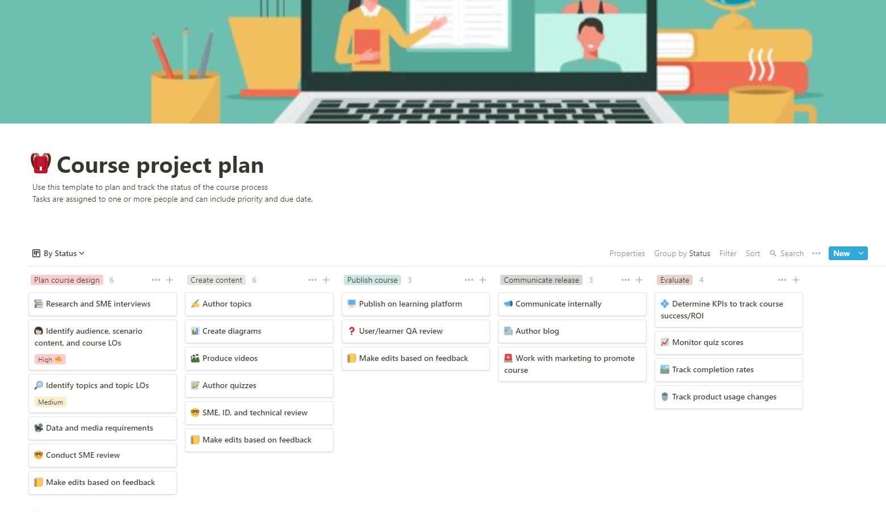

## Notion for Support teams! 

### The what
I put together this project plan as part of an interview assignment. For the assignment I created a project plan and work samples that consisted of a:

 - Course outline
 - Tutorial video that would be included in the course
 - Short knowledge check

> Take a look over the [entire plan](https://katieslearnings.com/assets/Notion-for-Support-Teams.pdf).

And check out the video I created for the assignment, below:

<iframe width="560" height="315" src="https://www.youtube.com/embed/Egl1VEOhELw" frameborder="0" allow="accelerometer; autoplay; clipboard-write; encrypted-media; gyroscope; picture-in-picture" allowfullscreen></iframe>

### The how

### The why
It's so important that new users have exceptional learning experiences when onboarding to a new software platform. Self-paced online learning courses play a significant role in this experience, and this course project plan ensures users (in this case, support reps):

 - Have all the necessary information they need to do their jobs effectively
 - Can intuitively navigate the learning experience
 - Get active learning experiences

